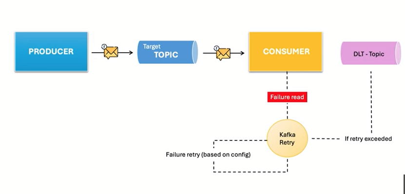
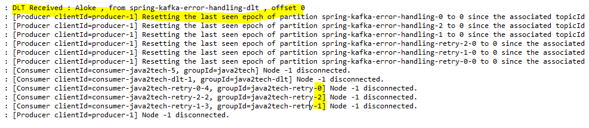
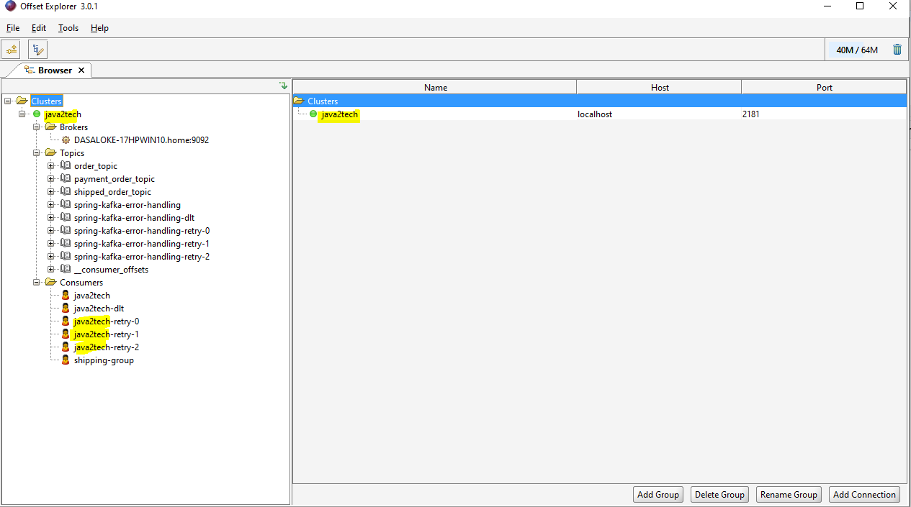

### Sping Kafka-error-handling
- Kafka Error Handling with Spring Boot | Retry Strategies & Dead Letter Topics (DLT).
- NOTE: A dead-letter topic or dead-letter queue (DLQ), is a holding queue for messages that cannot be delivered to their destination queues such as the queue does not exist, it is full or any transaction failure. We can those error bound messages for next decision.

## Prerequisites
- Spring Boot (3.2.1)
- Maven 
- Java (17)
- Libraries:
  * starter-web 
  * kafka
  * lombok

## Flow Diagram


## Step 1: Run Kafka Service (locally as below):
- Kafka Servers Start (local: eg. C:\kafka_2.13-3.7.0) with zookeeper.
* 1) .\bin\windows\zookeeper-server-start.bat .\config\zookeeper.properties
* 2) .\bin\windows\kafka-server-start.bat .\config\server.properties

## Step 2: Run Spring Boot spring-kafka-error-handling
- Call API to test the DLT (shared the Postman collection)
* Two (http://localhost:9191/producer/publish/users) APIs call for with DLT and without DLT approch for following request body
```
{
    "id": 101,
    "firstName": "Aloke",
    "lastName": "Das",
    "email": "alokebd@gmail.com",
    "gender": "M",
    "ipAddress": "192.168.2.31"
}
```
* http://localhost:9191/producer/publish/csv Call will upload from supplied CSV file (/resource) where both DLT and without DLT applied.

## Step 3: Check Application Console 


- Used Offset Explorer Tool to check  DLT/TOPIC and DATA



- Test with diffrent options of Retry (as mentioned in KafkaMessageConsumer.java)
* @RetryableTopic (attempts = "4", backoff = @Backoff(delay = 3000, multiplier = 1.5, maxDelay = 15000))
* @RetryableTopic(attempts = "4", exclude = {NullPointerException.class, RuntimeException.class})
  